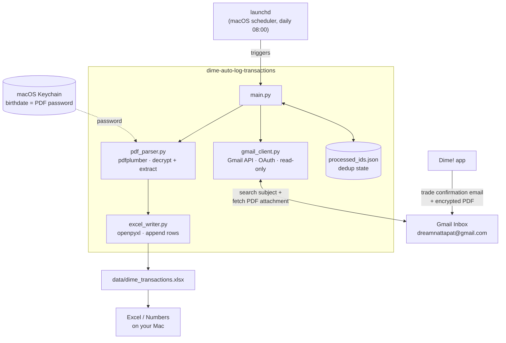

# Dime! Transaction Auto-Logger

Reads Dime! trade-confirmation emails (`[Dime!] ใบยืนยันการซื้อขาย`) from Gmail,
decrypts the attached PDF with your birthdate, extracts the transaction
details, and appends them to a local Excel file — on a schedule.

## Architecture



Everything right of Gmail runs locally on your Mac — no third-party server
ever sees the PDF, the birthdate, or the transaction data.

## How it works

1. **Gmail** — read-only access via the official Gmail API (OAuth), scoped to
   `gmail.readonly`. It never sends, deletes, or modifies anything.
2. **Search** — finds messages matching subject `[Dime!] ใบยืนยันการซื้อขาย`.
3. **PDF** — downloads the attachment, decrypts it with your birthdate
   (pulled from the macOS Keychain, never stored in a file), extracts text.
4. **Parse** — pulls out fields (ticker, exchange, buy/sell, units, price,
   USD + THB amounts, fees, FX rate, …) via regex tuned against real Dime!
   confirmation notes (`src/pdf_parser.py`). Handles multiple orders in a
   single email. If Dime! changes their PDF layout and fields start coming
   back empty, use `scripts/dump_pdf_text.py` to see the new raw text and
   adjust the patterns.
5. **Excel** — appends a row to `data/dime_transactions.xlsx`, skipping
   emails already processed (tracked in `data/processed_ids.json`).
6. **Schedule** — a `launchd` job runs it daily.

## Where your secrets live

- **Birthdate (PDF password)**: macOS login Keychain, service
  `dime-auto-log-transactions`, account `pdf-password`. Set via
  `scripts/setup_secret.py`, never written to disk in plaintext. Inspect or
  revoke it any time in `Keychain Access.app`.
- **Gmail OAuth token**: `credentials/token.json`, created after your first
  login. This directory is gitignored — don't commit it.
- **Google OAuth client secret**: `credentials/client_secret.json`, which
  you download yourself (step 2 below). Also gitignored.

## Setup

### 1. Install dependencies

```bash
cd /Users/dreamnattapat/Workspace/dime-auto-log-transactions
python3 -m venv venv
source venv/bin/activate
pip install -r requirements.txt
```

### 2. Create a Google OAuth client (one-time, in your browser)

1. Go to [Google Cloud Console](https://console.cloud.google.com/) and
   create a new project (or reuse one).
2. Enable the **Gmail API** for it (APIs & Services → Library → search
   "Gmail API" → Enable).
3. Configure the OAuth consent screen as **External** + **Testing** mode,
   and add `dreamnattapat@gmail.com` as a test user (this keeps it private
   to you, no Google review needed).
4. Create credentials → **OAuth client ID** → Application type
   **Desktop app**.
5. Download the JSON and save it as:
   `credentials/client_secret.json`

### 3. Store your birthdate in the Keychain

```bash
python3 scripts/setup_secret.py
```

### 4. First run (authorizes Gmail access)

```bash
python3 src/main.py --limit 1 --dry-run
```

This opens a browser window to log in and consent to read-only Gmail
access, then prints what it *would* write without touching the Excel file.

### 5. Real run

```bash
python3 src/main.py
```

Check `data/dime_transactions.xlsx` (opens fine in Excel or Numbers) and
`logs/dime_log.log`.

### 6. Schedule it with launchd

```bash
# Fill in the actual project path in the plist
sed -i '' "s|__PROJECT_DIR__|$(pwd)|g" launchd/com.dreamnattapat.dimelog.plist

cp launchd/com.dreamnattapat.dimelog.plist ~/Library/LaunchAgents/
launchctl load ~/Library/LaunchAgents/com.dreamnattapat.dimelog.plist
```

## Managing the schedule

**Where the time lives**: `launchd/com.dreamnattapat.dimelog.plist`, in the
`StartCalendarInterval` block (`Hour`/`Minute`). Defaults to 08:00 daily; a
commented-out weekly variant sits right above it in the same file.

> macOS actually runs the copy at `~/Library/LaunchAgents/com.dreamnattapat.dimelog.plist`,
> not the one in this repo. The repo copy is the source of truth — after
> editing it, re-copy it over (see "change the time" below) or your edit
> won't take effect.

| Action | Command |
|---|---|
| Check if it's currently on | `launchctl list \| grep dimelog` (any output = on) |
| Turn off | `launchctl unload ~/Library/LaunchAgents/com.dreamnattapat.dimelog.plist` |
| Turn back on | `launchctl load ~/Library/LaunchAgents/com.dreamnattapat.dimelog.plist` |
| Run it manually right now | `launchctl start com.dreamnattapat.dimelog` |
| Change the time | edit the plist, then `launchctl unload ...` → `cp launchd/com.dreamnattapat.dimelog.plist ~/Library/LaunchAgents/` → `launchctl load ...` |

## Useful commands

| Task | Command |
|---|---|
| Dry run, scan only 3 emails | `python3 src/main.py --limit 3 --dry-run` |
| Full sync | `python3 src/main.py` |
| Inspect one PDF's raw text | `python3 scripts/dump_pdf_text.py [message_id]` |
| Re-store birthdate | `python3 scripts/setup_secret.py` |
| Tail logs | `tail -f logs/dime_log.log` |

## Notes / things to know

- Re-running is safe — processed Gmail message IDs are tracked in
  `data/processed_ids.json`, so nothing gets double-logged.
- If Dime! ever changes its PDF layout, only `src/pdf_parser.py` needs
  updating — everything else is unaffected.
- Nothing in this repo talks to any third party besides Google's Gmail API;
  the PDF is parsed locally, and the birthdate never leaves your Mac.
